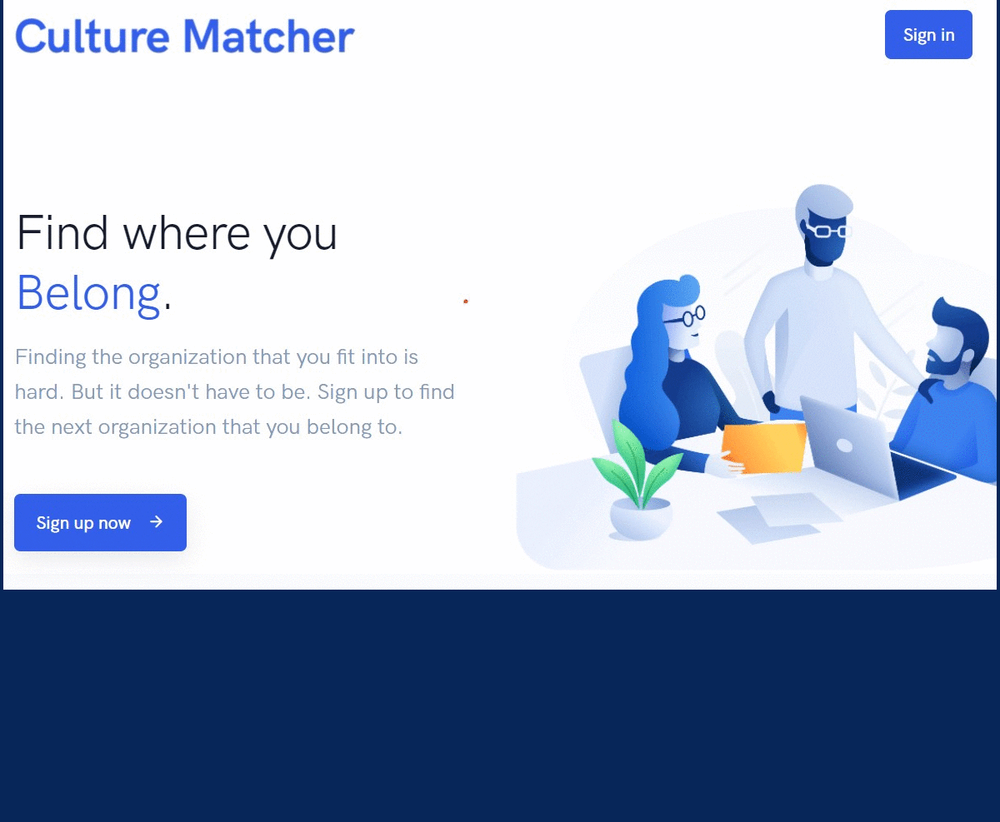

<h1>
  Culture Matcher - Displaying Company Matches
</h1>
<a href="http://culturematcher.org">Link to the live version of Culture Matcher website</a>
<h3>
  Overview
</h3>

This project uses academic research and advanced statistics to match job candidates with companies. I use Python, PHP, SQL, AWS EC2, AWS Lambda, and Bootstrap. This project aims to solve the problem that many early in career job seeks have with trying to find the right company to work for. Using academic research conducted by Klaus Weber it looks at job descriptions to identify what organizations value most. Then it tests candidates to identify what they value most. With that information, it uses identifies the best fit between candidates and organizations.

I used Python with Selenium to scrape Glassdoor for job descriptions and pandas to clean the resulting data. The backend of the website is hosted on AWS EC2 and API support is through AWS lambda. The site is rendered through PHP and SQL on the backend with the frontend developed with Bootstrap, HTML, CSS and Javascript. Please visit and test it out.

<h3>
  Concepts and Technologies Used
</h3>

  PYTHON, PHP, AWS EC2, AWS LAMBDA, HTML, CSS, JAVASCRIPT, BOOTSTRAP

